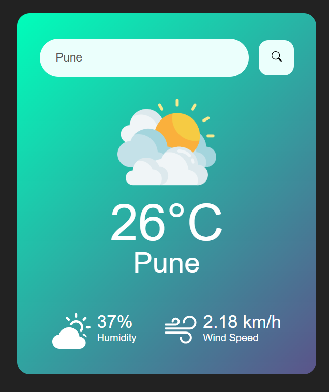

Weather App

🌦 Overview

This is a simple Weather App built using HTML, CSS, and JavaScript. It allows users to enter a city name and fetches real-time weather data, displaying the temperature along with other weather details.

✨ Features

🌍 Fetches real-time weather data

🌡 Displays temperature, humidity, wind speed, and weather conditions

🔍 Search by city name

🎨 Responsive UI with a clean design

🛠 Technologies Used

HTML for structuring the webpage

CSS for styling the UI

JavaScript for fetching and displaying weather data

OpenWeatherMap API for real-time weather updates

🚀 How to Run the Project

Clone the repository:

git clone https://github.com/Gayatrii4506/weather-app.git

Navigate to the project folder:

cd weather-app

Open index.html in your browser.

🔗 API Integration

This app uses the OpenWeatherMap API. You need an API key to fetch weather data:

Sign up on OpenWeatherMap and get an API key.

Add your API key in the JavaScript file:

const apiKey = 'YOUR_API_KEY';

📸 Screenshots

📜 License

This project is open-source and available under the MIT License.

👨‍💻 Contributing

Feel free to contribute by submitting a pull request or reporting issues.

📬 Contact

For any inquiries, reach out at gayatriduse4506@gmail.com

